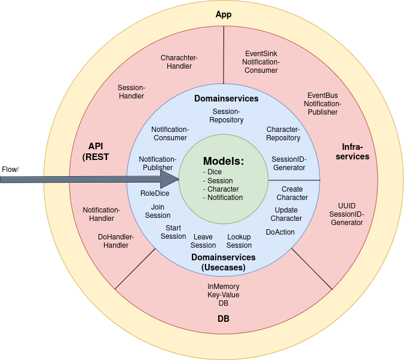

# A simple roleplay game server (kata solution)

The implementation is based on the idea of implementing a onion architected game server for the role playing game Fate Core. However it is much simpler than that:
- Start or join a session
- Do an Action, where you decide what it's called
- Any Action you do costs
- Any action cost are charged with the result of four Fate Core dices 
- The Session owner can gift or take points without the dices
- There is no upper or lower limit of your points
- Leave the session

Simple. 

My personal goals where mainly focused on the new http/net 1.22 and on how to implement the onion architecture. 

## Routes
| Description  | METHOD  | Route| Request | Query param | Response |
|--------------|---------|------|---------|-------------|----------|
| Start and Join a new session | POST |/session/new |`{"Title": "title", "OwnerID": 1} | none | UUID SessionID 
| Join an existing session | POST | /session/{sessionid}/join | {"CharacterID": 2 }|  none | none
| Leave an existing session | POST | /session/{sessionid}/leave | {"CharacterID": 2 } |  none | none
| List the partymembers (owner only) | GET | /session/{sessionid}/party | {"OwnerID": 1} |  none | [{Charactes in session}]
| Load notification for a character | GET |  /session/{sessionid}/notification | none| charID, offset* | [{Character notifications}]
| Create a new character | POST | /character/new | {"Name": "name", "Description": "desc."} |  none | Character ID
| Do your action | POST | /character/do/action | { "ActionName": "reject pr", "CharacterID": 2, "OwnerAction": false, "Costs": -10,"SessionID": "sID" }|  none | Dice result, new character points
| Gift take points, no dice role (owner only)** | POST | /character/do/points | { "ActionName": "adjustment", "CharacterID": 2, "OwnerAction": true, "Costs": 100,"SessionID": "sID"} | none | Dice result (0), new character points

In `./httptest/tryit.md` you can find explicit examples with curl. 

## Architecture overview

## Flaws and Learnings

This is my very own personal rating. You can agree or disagree. If you want to provide feedback, please do, I am looking forward to it!

| area  | personal rating (max: 5)  | description  | 
|--------------|-----------|-----------|
| API-Design   | ●●        | Didn't quite understand the fate system in the first place and moved to a simpler version. Many refactors over the time. Things don't work, or are bad designed.
| Architecture | ●●●●      | Hard to undestand. There are so many and different approaches. Don't feels goish but managed it quite well.
| Restful      | ●●●●      | Learned a lot about net/http 1.22. Many is not implemented here tho. Middlewares are fun. ServerMux is fun. 
| Concurreny   | ●         | There is no locking implemented on purpose. The fokus was on arch and rest.
| Testing      | ●●        | There are tests but nothing special. Could be better, but its not worse.
| Code Quality | ●●●       | After a trilion refactorings the quality is lacking love. It's good enough to be not hated anymore.
| Interfaces   | ●●●●      | Small and simple. Notification was fun to implement but it could be much better.  
| Documentation| ●         | Unlike me, it's not much tho. I documented the stuff I will come back later for a lookup 